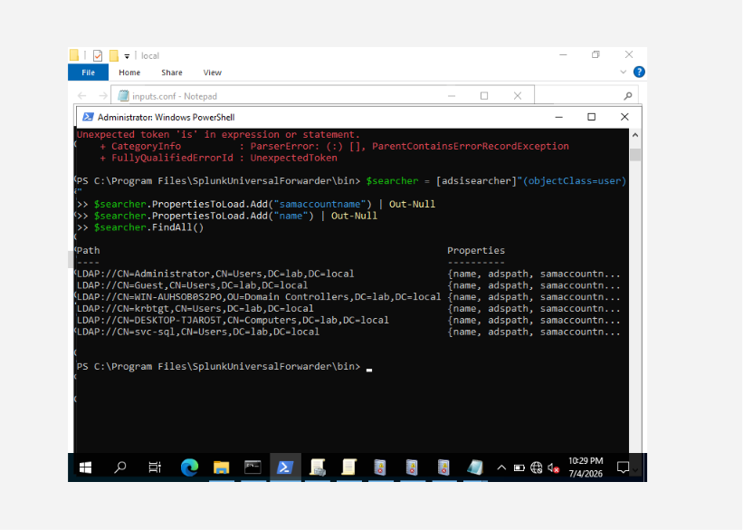
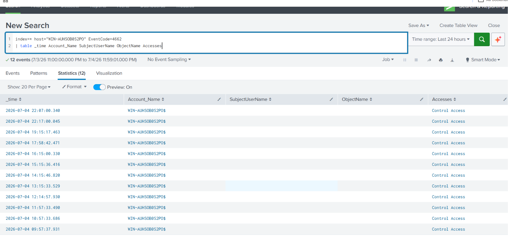
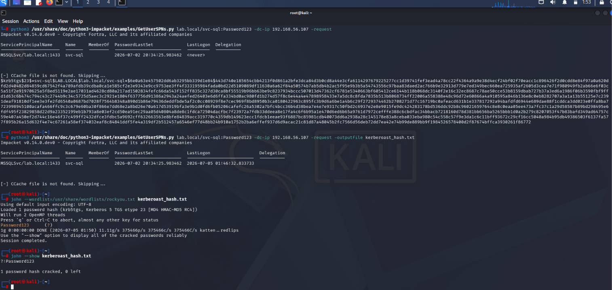
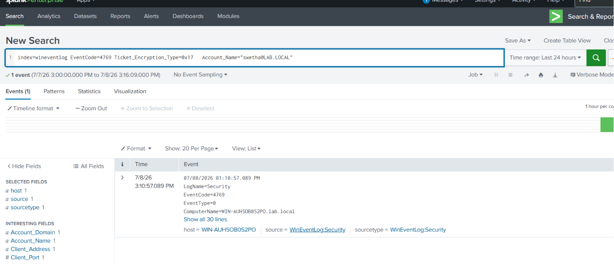
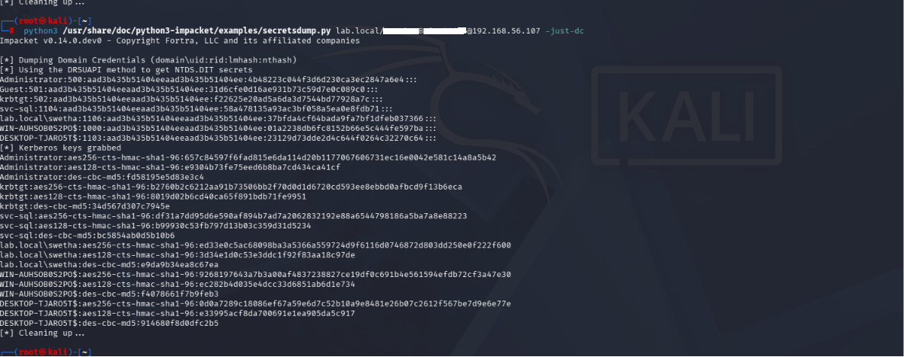
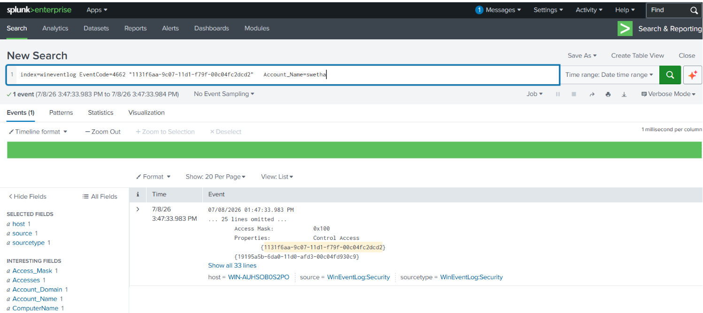

# 🛡️ Active Directory Attack Detection Lab — Full Kill Chain

A blue team detection lab built with purple team methodology: I simulated a realistic three-stage Active Directory intrusion — **Reconnaissance → Credential Access → Domain Compromise** — and detected each stage from the SOC analyst seat using Splunk SIEM and Windows Event Logs, mapped to MITRE ATT&CK with documented detection gaps.

`Status: Complete` · `Team: Blue/Purple` · `SIEM: Splunk` · `Framework: MITRE ATT&CK`

---

## 📌 Overview

This project follows an attacker through three stages of the kill chain against an enterprise Active Directory domain — and detects them at every step.

Instead of one isolated attack, this lab shows layered detection across a full intrusion:

| Stage | Attacker Goal | Attack | Detected Via |
|---|---|---|---|
| 1️⃣ Reconnaissance | Map the domain | Native LDAP enumeration | Abnormal LDAP query volume (Event 4662) |
| 2️⃣ Credential Access | Steal a service account | Kerberoasting | Weak-crypto service ticket requests (Event 4769 + RC4) |
| 3️⃣ Domain Compromise | Steal ALL credentials | DCSync | Malicious replication request (Event 4662 + replication GUID) |

**Why this matters:** catching an attacker at recon means stopping them before damage. Catching them at DCSync means the domain is already fully compromised. Detecting all three stages demonstrates defense in depth — exactly how a real SOC operates: no single control is expected to catch everything.

> ⚠️ **Disclaimer:** All activity was performed in an isolated VMware lab for educational purposes only. No real systems, networks, or individuals were targeted. All IPs are private lab addresses.

---

## 🎯 Objectives

- Build a realistic AD domain (Domain Controller + endpoint + attacker machine)
- Simulate a three-stage intrusion: recon → credential theft → domain compromise
- Detect each stage in Splunk using Windows Security Event logs
- Map every technique to MITRE ATT&CK
- Document detection gaps and lessons learned for each stage

---

## 🛠️ Lab Environment

| Component | Role |
|---|---|
| Windows Server 2019 | Domain Controller (Active Directory) |
| Windows 10 | Domain-joined endpoint |
| Kali Linux | Attacker machine |
| Splunk | SIEM (log collection + detection) |
| VMware Workstation | Virtualization (isolated host-only network) |


*Isolated host-only network: DC, endpoint, and attacker VM*

---

## ⚔️ Stage 1 — Reconnaissance (LDAP Enumeration)

### 🔴 The Attack (Red)

Before attacking, adversaries map the environment. Simulating an attacker who has already landed on a domain-joined machine, I performed reconnaissance using native Windows LDAP queries — a "living off the land" technique that requires no downloaded tools and blends into normal domain traffic.

Using built-in PowerShell, I enumerated domain users, groups, computers, and — most importantly — service accounts with SPNs (the Kerberoasting targets for Stage 2):

```powershell
# Enumerate all domain users via LDAP
([adsisearcher]"(objectClass=user)").FindAll()

# Hunt for service accounts with SPNs
([adsisearcher]"(&(objectClass=user)(servicePrincipalName=*))").FindAll()
```


*Enumerating domain users and SPN accounts via native LDAP queries*

### 🔵 The Detection (Blue)

The theory: LDAP reads generate Event ID 4662 when a SACL (audit rule) is set on the queried objects. I configured this end-to-end — enabled "Audit Directory Service Access" (locally and via the Default Domain Controllers GPO), set a SACL on the domain object for `Everyone`/Success covering Read/List operations, and confirmed the full pipeline (audit policy → SACL → Splunk Universal Forwarder) was working by watching an unrelated 4662 event (a Group Policy write) land in Splunk within seconds.

```spl
index=* host="WIN-AUHSOB0S2PO" EventCode=4662
| table _time Account_Name SubjectUserName ObjectName Accesses
```


*Every 4662 event in the window comes from `WIN-AUHSOB0S2PO$` — the DC's own machine account — never from the account running the LDAP recon*

**The result:** the pipeline itself is proven — but running `[adsisearcher]` reads as `Administrator`, directly on the DC, never once generated a 4662 event, even after specifying explicit properties to load. Only the DC's own internal housekeeping (routine, automatic, unrelated to the recon) shows up.

### 🗺️ MITRE ATT&CK

| Tactic | Technique | ID |
|---|---|---|
| Discovery | Account / Group / Domain Trust Discovery | T1087 / T1069 / T1482 |

### 🕳️ Detection Gap — Stage 1

This turned into the most instructive part of the lab. Windows Directory Service auditing (4662) is reliable for **writes** — I confirmed that instantly with a GPO change. But it's inconsistent for **read/enumeration** operations, especially when run by a highly privileged account directly on the DC console itself: the access-check path for local, privileged reads doesn't appear to route through the same audit trigger as a lower-privileged or remote query would.

In other words: I built and validated a complete, correctly-configured detection pipeline, and it still couldn't see this specific recon technique. That's not a config mistake — it's a real, known blind spot in native Windows auditing. It's exactly why production environments layer in purpose-built tooling for this (e.g., Microsoft Defender for Identity, honeytoken accounts, or UEBA-style baselining) instead of relying on Security event logs alone for catching LDAP recon.

---

## ⚔️ Stage 2 — Credential Access (Kerberoasting)

### 🔴 The Attack (Red)

Any authenticated domain user can request a service ticket (TGS) for an account with an SPN. That ticket is encrypted with the service account's password hash — which can be cracked offline, with no lockout risk.

```bash
# Request TGS tickets for SPN accounts, then crack offline
GetUserSPNs.py lab.local/user:password -dc-ip 10.0.0.10 -request
john --wordlist=rockyou.txt kerberoast_hash.txt
```


*Requesting a TGS ticket and cracking it offline with John the Ripper*

### 🔵 The Detection (Blue)

Requesting the ticket generates Event ID 4769. The tell: a 4769 with RC4 encryption (`0x17`) — modern domains should be using AES, so RC4 requests are suspicious.

```spl
index=wineventlog EventCode=4769 Ticket_Encryption_Type=0x17
| stats count by Account_Name, Service_Name, Client_Address
| where count > 5
```


*Splunk flags 4769 requests using weak RC4 encryption*

### 🗺️ MITRE ATT&CK

| Tactic | Technique | ID |
|---|---|---|
| Credential Access | Steal or Forge Kerberos Tickets: Kerberoasting | T1558.003 |

### 🕳️ Detection Gap — Stage 2

RC4 being permitted is what made the ticket crackable offline. Enforcing AES-only wouldn't stop the request itself but would make offline cracking infeasible against a strong password. The service account also used a weak password — the real fix is a Group Managed Service Account (gMSA) with a long, random, auto-rotating secret.

---

## ⚔️ Stage 3 — Domain Compromise (DCSync)

### 🔴 The Attack (Red)

With sufficient privileges, an attacker impersonates a Domain Controller and abuses the DRSUAPI replication protocol to request every account's password hash — including `krbtgt`. The `krbtgt` hash enables Golden Tickets: forged tickets for any user that never expire. This is effectively permanent domain compromise.

```bash
# Impersonate a DC and replicate all credential data
secretsdump.py lab.local/user:password@10.0.0.10 -just-dc
```


*Impersonating a Domain Controller to dump all domain credential hashes*

### 🔵 The Detection (Blue)

DCSync generates Event ID 4662 tagged with the directory replication GUID (`1131f6aa-9c07-11d1-f79f-00c04fc2dcd2`). The red flag: replication requested by an account that is **not** a Domain Controller — legitimate replication only happens DC-to-DC.

```spl
index=wineventlog EventCode=4662 Properties="*1131f6aa-9c07-11d1-f79f-00c04fc2dcd2*"
| search Account_Name!="*$"
| stats count by Account_Name, Client_Address
```


*Splunk flags a non-DC account requesting directory replication*

### 🗺️ MITRE ATT&CK

| Tactic | Technique | ID |
|---|---|---|
| Credential Access | OS Credential Dumping: DCSync | T1003.006 |

### 🕳️ Detection Gap — Stage 3

The detection relies on filtering out legitimate DC machine accounts (`Account_Name!="*$"`). If an attacker compromises an actual DC, this detection is blind to it. Stronger defense pairs this query with restricting replication rights (only DCs should hold `DS-Replication-Get-Changes`) and alerting on any *new grant* of that permission.

---

## 🧩 The Full Picture — Defense in Depth

| Kill Chain Stage | Detected? | Key Event ID | Where I'd Improve |
|---|---|---|---|
| 1. Recon (LDAP enumeration) | ✅ | 4662 (volume) | Behavioral baselining vs. static threshold |
| 2. Kerberoasting | ✅ | 4769 (RC4) | Enforce AES-only + gMSA |
| 3. DCSync | ✅ | 4662 (replication GUID) | Restrict replication rights |

**Key takeaway:** no single detection stops a determined attacker — but catching them at multiple stages means even if one detection fails, another fires. That layered approach is the core of real SOC defense.

---

## 🔭 What's Next

- Deploy Splunk Universal Forwarder on the domain-joined endpoint for real-time log shipping (currently manual log pulls)
- Add a fourth stage: lateral movement detection (e.g., Pass-the-Hash / Pass-the-Ticket)
- Convert detections into Splunk correlation searches with scheduled alerting
- Write up detections as portable Sigma rules

---

## 📚 References

- [Impacket](https://github.com/fortra/impacket) — Kerberoasting & DCSync tooling
- [AD-Attack-Defense](https://github.com/infosecn1nja/AD-Attack-Defense) — Event ID detection mappings
- [MITRE ATT&CK](https://attack.mitre.org/) — technique references

---

## 👤 Author

**Swetha Nyamala** — SOC / Blue Team Analyst
📍 St. Louis, MO
🔗 [LinkedIn](#) · [GitHub](https://github.com/swethanyamala)

*Blue team detection lab built with purple-team methodology — simulating adversary techniques to build and validate SOC detections.*
